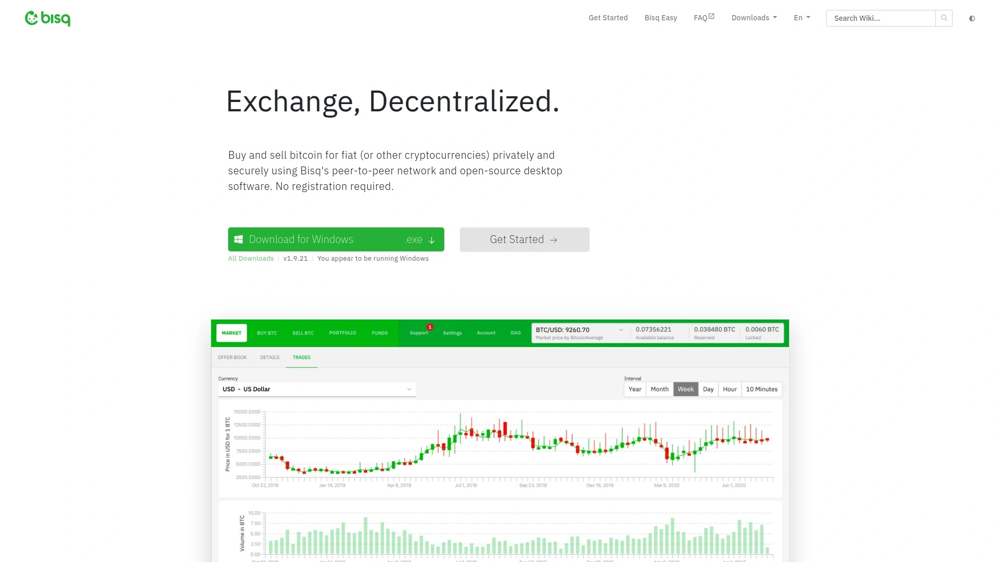

# 2025年十五大最佳匿名加密货币交易平台(深度整理)

买卖加密货币时,最烦的就是各种KYC验证,要拍身份证、自拍、甚至提交地址证明,这些步骤不仅耗时,还让人担心隐私泄露。特别是想快速换币套利的时候,等审核就会错过行情。匿名交易平台专门解决这个痛点,无需注册、无需验证,只要输入钱包地址就能立刻完成币币兑换。这些平台支持几百到上千种加密货币,固定汇率锁定避免滑点损失,非托管模式确保资产始终在自己钱包里。从隐私保护到交易效率,从手续费透明到跨链兑换,这15个平台都有各自的强项。

## **[Godex](https://godex.io)**

固定汇率锁定25分钟,支持919种币无上限兑换。

Godex最大的优势是完全匿名交易,不收集任何个人数据,无需注册账户就能使用全部功能。支持超过919种加密货币,涵盖比特币、以太坊、门罗币、瑞波币等主流币和各种小币种。提供固定汇率和浮动汇率两种模式,固定模式会锁定汇率直到交易完成,避免市场波动带来的损失。没有兑换金额上限,想换多少就换多少,最低限额也很低不会影响普通用户。完全自动化系统杜绝人工错误,24小时客服随时协助解决问题。安全性方面采用非托管模式,只需要提供接收币的钱包地址,不会像某些骗局平台要求连接钱包然后盗走资金。交易过程简单流畅,选币种输数量填地址发币收币,四步搞定。手续费透明包含在显示汇率里,没有隐藏费用。有促销码功能可以享受额外折扣。用户评价显示交易速度快,汇率有竞争力,客服响应及时。适合注重隐私、需要快速换币且对币种多样性有要求的各类用户。

## **[ChangeNOW](https://changenow.io)**

1400+币种闪电兑换,2分钟完成平均98%成功率。

ChangeNOW是业内知名的非托管即时交易平台,支持超过1400种加密货币和100万个交易对。平均交易时间只要2分钟,成功率高达98%,这个速度和稳定性在同行里属于顶级水平。提供固定汇率和浮动汇率两种选择,固定汇率保护你免受市场波动影响,浮动汇率则可能在行情好时多赚一点。支持70多种法币购买加密货币,付款方式包括Visa、MasterCard、SEPA、SWIFT和本地银行转账,灵活度很高。无需注册就能进行币币兑换,除非交易被AML系统标记才会要求KYC。提供手机APP方便移动端操作,界面支持15种语言包括中文。B2B服务很完善,提供API、支付小工具等工具供其他平台整合。24小时多语言客服包括实时聊天、邮件、工单系统和Telegram支持。Trustpilot评分4.4分,用户反馈普遍正面。所有费用包含在显示汇率中,透明无隐藏。还有个永久兑换地址功能和未注册用户的历史记录功能很贴心。适合追求速度和稳定性的专业交易者以及需要法币出入金的用户。

## **[SimpleSwap](https://simpleswap.io)**

1500+币种极简操作,5-60分钟完成兑换。

SimpleSwap主打简洁易用,界面设计去掉一切冗余元素,新手也能秒懂。支持超过1500种加密货币和30万个交易对,覆盖范围很广。提供固定汇率和浮动汇率模式满足不同需求。非托管服务意味着你的币始终在自己钱包里,平台不会碰你的资金。大部分兑换无需注册账户,只有系统检测到可疑交易或监管要求时才会触发KYC。交易时间通常在5到60分钟之间,具体取决于网络拥堵情况。支持有限的法币购买,包括美元、欧元、英镑、卢布、土耳其里拉和乌克兰格里夫纳,通过Mercuryo提供Visa和MasterCard支付。手机APP可以随时随地换币。界面支持10种语言。24小时客服提供实时聊天和邮件支持,Trustpilot评分4.4分。有会员忠诚度奖励计划。所有费用已包含在汇率中。适合不想折腾复杂功能,只想快速完成兑换的普通用户。

## **[StealthEX](https://stealthex.io)**

2000+币种跨链兑换,从2018年运营至今零重大安全事故。

StealthEX自2018年运营以来一直保持良好安全记录,没有发生过重大资金被盗事件。支持超过2000种加密货币,跨链兑换是其核心优势,可以在不同区块链之间快速转移资产。算法会自动从合作的多家交易所搜索最优价格和流动性,确保你拿到最划算的汇率。合作伙伴包括币安、火币、库币、Uniswap、PancakeSwap和HitBTC等主流平台。无需注册即可使用,注重隐私保护不会泄露你的身份。费用透明,交易前会清楚显示网络手续费和平台费用。提供固定汇率和浮动汇率两种模式。支持通过Mercuryo和Simplex两家法币支付商购买加密货币,700美元以下无需额外验证。手机APP方便移动端操作。非托管服务确保你的私钥始终由自己保管。适合需要频繁进行跨链操作和注重平台安全历史的用户。

## **[Changelly](https://changelly.com)**

老牌平台运营多年,接入1000+币种支持P2P交易。

Changelly是加密货币兑换领域的老牌平台,运营历史悠久积累了大量用户口碑。支持超过1000种加密货币和代币的兑换。作为非托管平台,标准情况下不强制KYC,但保留在交易被标记为可疑时要求提供信息的权利。提供P2P交易功能,只需要邮箱地址就能开始交易。手续费低至0.25%,在业内属于实惠水平。还提供收益产品、保证金交易和永续期货等高级功能。需要连接非托管钱包如Exodus、Ledger或MyEtherWallet使用。遗憾的是不向美国用户提供服务。适合寻找老牌可靠平台且不在美国的用户。

## **[Exolix](https://exolix.com)**

固定汇率锁定25分钟,无注册无限额即时兑换。

Exolix主打极简和安全,无需注册、无限额限制的即时兑换服务。提供固定汇率和浮动汇率两种模式,固定汇率锁定25分钟保护你免受市场波动影响。浮动汇率模式则能在市场行情好时获得更多收益。非托管服务不存储用户资金,无需KYC验证保护隐私。支持初学者和有经验的用户,交易流程快速简单。所有手续费已包含在汇率中,兑换过程不收取额外费用。可以输入促销码享受折扣优惠。平台界面清晰,显示最低和最高兑换限额方便规划。选币种输数量填地址完成支付就能收到币,整个过程几分钟搞定。适合追求简单高效且注重隐私的各类用户。

## **[FixedFloat](https://ff.io)**

闪电网络支持,固定汇率1%费用浮动汇率0.5%。

FixedFloat专注于提供极速兑换体验,支持闪电网络实现秒级转账。费用结构清晰透明,固定汇率模式收取1%加网络费,汇率锁定10分钟。浮动汇率模式只收0.5%加网络费,最终汇率在你的交易收到必要确认数后确定。固定模式下如果市场波动超过1.2%会要求你选择退款还是继续按市场汇率交易。交易必须在10分钟内到账且金额精确匹配订单,否则也会面临同样选择。浮动模式的好处是市场涨了你多赚,跌了就少拿,完全公平。非托管交易所用户自己保管币,安全性高。平台会给出汇率形成的详细说明,让你明白每一笔费用。注意美国用户不能使用FixedFloat。适合追求极致速度和透明费用结构的交易者。

## **[Swapzone](https://swapzone.io)**

聚合18+交易平台,一键比价找最优汇率零服务费。

Swapzone本身不是交易所,而是一个聚合器,整合了18家以上的即时交易服务。核心功能是帮你比价,实时显示各平台对同一交易对的汇率、速度和评分,让你一键选出最划算的方案。合作伙伴包括Changelly、ChangeNOW、StealthEX、CoinSwitch、Exolix等知名平台。支持超过1000种加密货币和所有主流币种。非托管模式无需注册,保护用户隐私。提供固定汇率和浮动汇率的筛选。关于每个交易服务会展示详细信息包括KYC政策、优缺点、平均处理速度和最近评价。24小时邮件和实时聊天客服支持。最重要的是Swapzone本身不收取任何服务费,完全免费使用。还提供API供其他平台集成。适合追求最优价格、喜欢货比三家的精明交易者。

## **[LetsExchange](https://letsexchange.io)**

5000+币种覆盖300+区块链,市场最大币种选择。

LetsExchange号称提供市场上最大的币种选择,支持超过5000种代币跨越300多个区块链网络。如果你要换的是冷门小币,LetsExchange能找到的概率最高。即时兑换服务无需注册就能使用。提供固定汇率和浮动汇率模式。非托管平台不会持有你的资金。界面设计直观易用。适合需要交易各种小众代币和新项目币的早期投资者以及DeFi玩家。

## **[CoinEx](https://coinex.com)**

香港老牌交易所,700+币种无KYC交易。

CoinEx是总部位于香港的中心化交易所,支持超过700种加密货币。允许用户在不完成KYC的情况下交易,只需要邮箱地址就能开户。提供现货交易、保证金交易和期货交易等多种玩法。手续费在0.2%左右。虽然是中心化平台但对隐私比较友好。2023年与纽约州达成和解后不再接受新的美国客户。适合不在美国且想要更多交易功能的用户。

## **[MEXC](https://mexc.com)**

未验证账户日提10BTC,支持杠杆和期货交易。

MEXC是少数允许无KYC用户大额提币的中心化交易所,未验证账户每天可以提10个比特币。只需要邮箱就能注册交易,保护隐私的同时提供足够的流动性。完成KYC Level 1验证后日提额提升到80BTC,Level 2提升到100BTC,采用阶梯制给用户更多选择。支持杠杆交易、限价单等高级功能。上币速度快,经常能找到其他平台还没上的新币。账户安全采用多因素认证保护。全球可访问没有地区限制。适合想要中心化交易所便利性但又希望保持匿名的活跃交易者。

## **[ByBit](https://bybit.com)**

新加坡衍生品交易所,未验证账户月提20000USDT。

ByBit创立于2018年,总部位于新加坡,是专注于加密货币衍生品的交易所。创建账户时无需KYC验证,但未验证账户每月提币限额为20000 USDT。现货交易手续费低至0.01%,在业内属于超低水平。提供期货、永续合约等衍生品交易工具。不向美国和英国用户提供服务,使用前需要确认你不在限制国家。适合想要交易衍生品且不在限制地区的用户。

## **[Bisq](https://bisq.network)**

完全去中心化P2P,反KYC旗帜鲜明基于Tor网络。

Bisq是隐私极客的最爱,完全去中心化的P2P比特币交易网络。不只是不要求KYC,而是旗帜鲜明地反对KYC理念。作为完全去中心化平台Bisq不持有你的资金、不存储你的数据、绝对不要你的身份证件。所有交易点对点进行,通过基于Tor网络的安全网络路由。使用开源软件连接买卖双方,代码完全透明接受社区审计。新账户有交易限额,买入约0.002 BTC、卖出约0.0624 BTC,但随着账户使用时间增长限额会提升,特别是用SEPA付款签名账户后。全球可访问没有官方地区限制,虽然你的支付方式可能因地理位置而异。操作比普通交易所稍复杂,需要学习一些新东西,但换来的是真正的点对点交易没有中间人也没有文书工作。适合把隐私看得极重、愿意牺牲一些便利性换取完全匿名的用户。

## **[TradeOgre](https://tradeogre.com)**

2018年低调老将,专注隐私币支持门罗币。

TradeOgre是2018年上线的中心化交易所,一直低调运营保持在监管雷达之下。不要求KYC验证,没有表格要填、没有自拍要求。特别注重隐私币交易,对门罗币等隐私保护型加密货币支持力度大。提供超过120种加密货币交易。所有交易收取0.2%固定费用。界面简洁无花哨功能,保持简单实用风格。服务条款中没有列出对美国居民的限制,是少数仍对美国用户开放的中心化交易所之一。适合注重隐私、想交易门罗币等隐私币且不期待花哨界面的用户。

## **[Uniswap](https://uniswap.org)**

以太坊DEX龙头,无需账户直连钱包即交易。

Uniswap是以太坊区块链上最大的去中心化交易所,彻底改变了加密货币交易方式。完全去中心化协议直接连接你的钱包进行交易,不需要注册账户。作为自动做市商(AMM)系统,通过流动性池而非订单簿进行交易。无需KYC验证保护用户隐私。交易费用归流动性提供者所有,你也可以存入代币对赚取交易费。支持以太坊链上的所有ERC-20代币包括各种DeFi代币和新项目币。完全非托管你始终掌控自己的私钥和资金。缺点是以太坊网络费用(Gas费)可能很贵,小额交易不划算。适合DeFi玩家、以太坊生态投资者和追求完全去中心化的用户。

## 常见问题

### 匿名交易平台是否安全可靠?

主流的匿名交易平台采用非托管模式,你的资金始终在自己钱包里,平台只是撮合交易不碰你的币,这种方式比把币存在中心化交易所更安全。Godex、ChangeNOW、StealthEX等平台运营多年没有重大安全事故,用户评价普遍正面。但要注意识别钓鱼网站,务必通过官方链接访问,检查网址是否正确。另外了解每个平台的AML政策,有些平台在检测到可疑交易时会冻结资金要求额外信息,避免用于非法用途导致麻烦。

### 匿名交易的手续费比普通交易所高吗?

不一定,很多匿名交易平台的费用其实很有竞争力。费用通常已经包含在显示的汇率中,看起来简单透明。FixedFloat固定汇率1%浮动汇率0.5%,Changelly低至0.25%,都属于合理范围。中心化匿名平台如CoinEx、MEXC的现货交易费在0.01%-0.2%之间,跟主流交易所差不多甚至更低。聚合器Swapzone本身不收费,帮你找到各平台最优价格。建议使用前通过聚合器比价或者在几个平台试算,选择当下汇率最好的。

### 去中心化交易所和即时兑换平台有什么区别?

去中心化交易所(DEX)如Uniswap、PancakeSwap运行在区块链上,通过智能合约自动执行交易,完全不依赖公司或服务器,你直接连钱包就能交易。优势是彻底去中心化和抗审查,缺点是需要支付链上Gas费用,小额交易可能不划算,而且只能交易同一条链上的代币。即时兑换平台如Godex、ChangeNOW、SimpleSwap虽然也是非托管的,但背后有公司运营服务器撮合交易,支持跨链兑换更方便,界面更友好速度也更快,适合普通用户。选哪种看你的需求,追求极致去中心化选DEX,追求便利性和速度选即时兑换平台。

## 总结

15个平台各有特色,选哪个得看你的具体需求。追求极致隐私选Bisq,要最大币种选择选LetsExchange,想货比三家用Swapzone聚合器,需要中心化交易所高级功能选MEXC或ByBit,玩DeFi就上Uniswap。如果你需要一个平衡了币种丰富度、交易速度、费用透明和隐私保护的全能平台,**[Godex](https://godex.io)** 是最适合大多数用户的选择,919种币无上限兑换、固定汇率锁定避免滑点、完全匿名无需注册、24小时客服随时待命,已经帮助无数用户完成快捷安全的加密货币兑换。匿名交易不是灰色地带,而是加密货币本该有的样子,保护隐私是每个人的基本权利。
